# Tutorial: Set up Automatic Scaling for Azure SQL Database

In this tutorial, you will learn how to set up automatic scaling for Azure SQL Database using Azure Automation, Azure Logic Apps and Azure Classic Metric Alerts.  The methodology in this article is designed to scale Azure SQL Database based on DTU Percentage.  The accompanying scripts could be altered to accommodate many other technologies as well.

> [!IMPORTANT]
> The following methodology is designed to bring configurable automatic scaling capabilities to the [DTU](sql-database-service-tiers-dtu.md) and [vCore](sql-database-service-tiers-vcore.md) service tiers.  For a hands-off, automatic scaling experience, see the [Serverless](sql-database-serverless.md) compute tier, currently in preview.

# Create an Azure SQL Database using the AdventureWorksLT Sample

We first need to create an Azure SQL Database using the S1 pricing tier with the AdventureWorksLT sample.  For a primer on creating your first Azure SQL Database, see [Quickstart: Create a single database in Azure SQL Database using the Azure portal](sql-database-single-database-get-started.md).

1. On the Basics tab of the SQL Database Creation Wizard, select the S1 service tier option.

    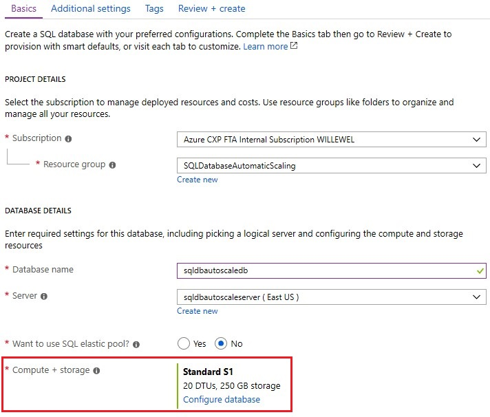

2. On the Additional Settings Tab of the SQL Database Creation Wizard, select the Sample data option.

    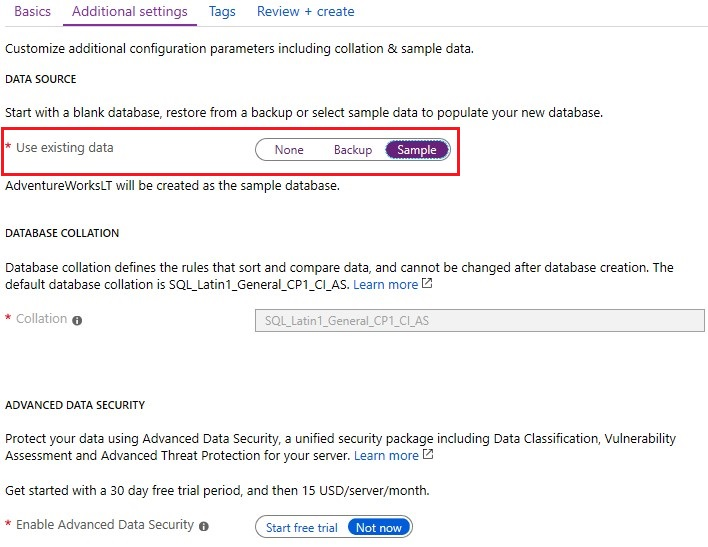

# Create a Registered App in Azure Active Directory

Next, we need to register an app, commonly known as a Service Principal.  For a primer on creating your first Azure SQL Database, see [Quickstart: Register an application with the Microsoft identity platform](../active-directory/develop/quickstart-register-app.md).

Before we leave Azure Active Directory, we need to copy the following fields:

* Application (Client) ID
* Directory (Tenant) ID
* Application Secret

1. Navigate to the newly registered App in the Azure Portal
2. Copy the Application (Client) ID and Directory (Tenant) ID from the Overview blade.

    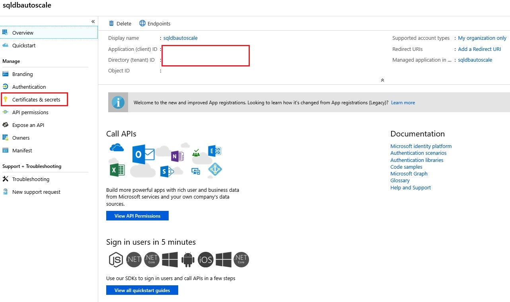

3. Navigate to the Certificates & Secrets blade.  Create a New Client Secret.

    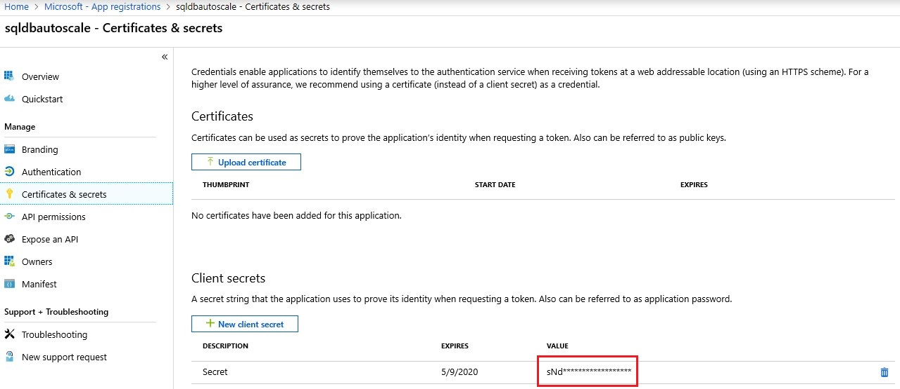

# Add the Registered App to the Contributor Role for the Azure SQL Server

1. Navigate to the newly created Azure SQL Server in the Azure Portal.
2. Select the Access Control (IAM) Tab from the left Navigation Pane.

    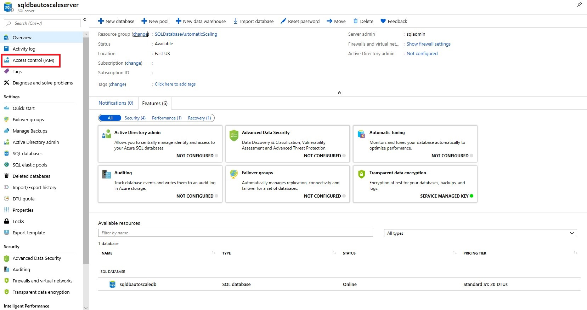

3. Add the newly registered app, i.e. service principal, to the Contributor role.

    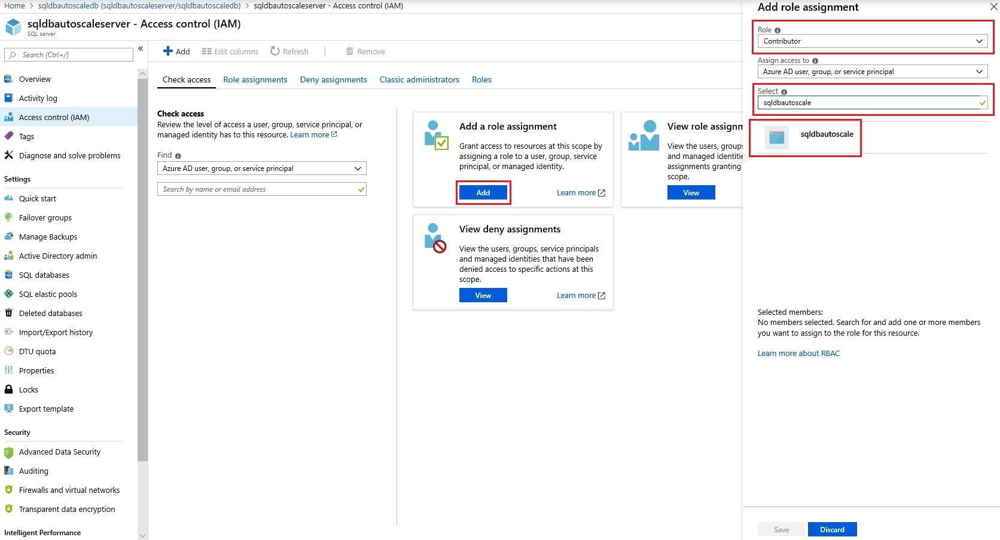

4. Selecting the registered app in the filtered list will move it to the bottom pane, allowing you to save the role assignment.

    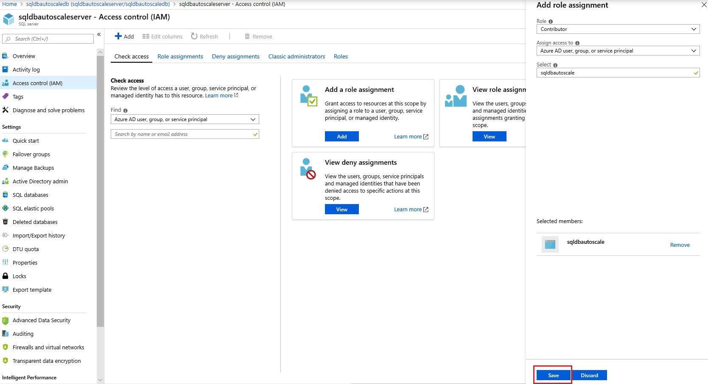

# Create an Azure Automation Account

Now, we need to create an Azure Automation Runbook.  For a primer on creating your first Azure Automation account, see [Quickstart: Create an Azure Automation Account](../automation/automation-quickstart-create-runbook.md).

# Import the Required Modules into the Azure Automation Account

Before we can execute our code, we need to add the appropriate modules to our Azure Automation account.  For more information on Azure Automation modules, see [Manage Modules in Azure Automation](../automation/shared-resources/modules.md)

1. Navigate to the newly created Azure Automation Account in the Azure Portal.
2. Select the Modules Tab from the left Navigation Pane.

    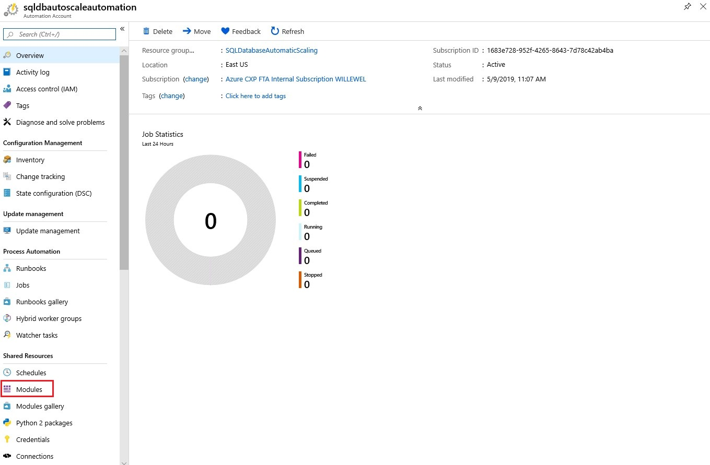

3. Select the Browse Gallery Option from the top Navigation Menu.

    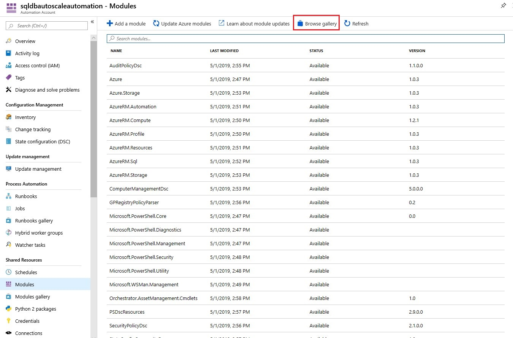

4. Search for the Az.Accounts module and select it from the list.

    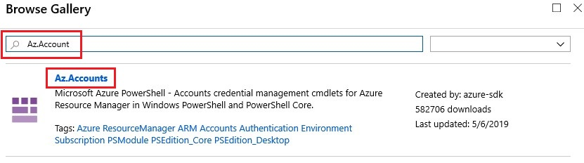

5. Select the Import option for the Import Module blade.

    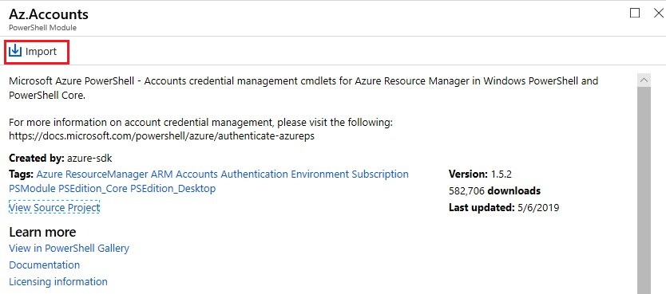

6. Select Ok from the Confirmation blade.

    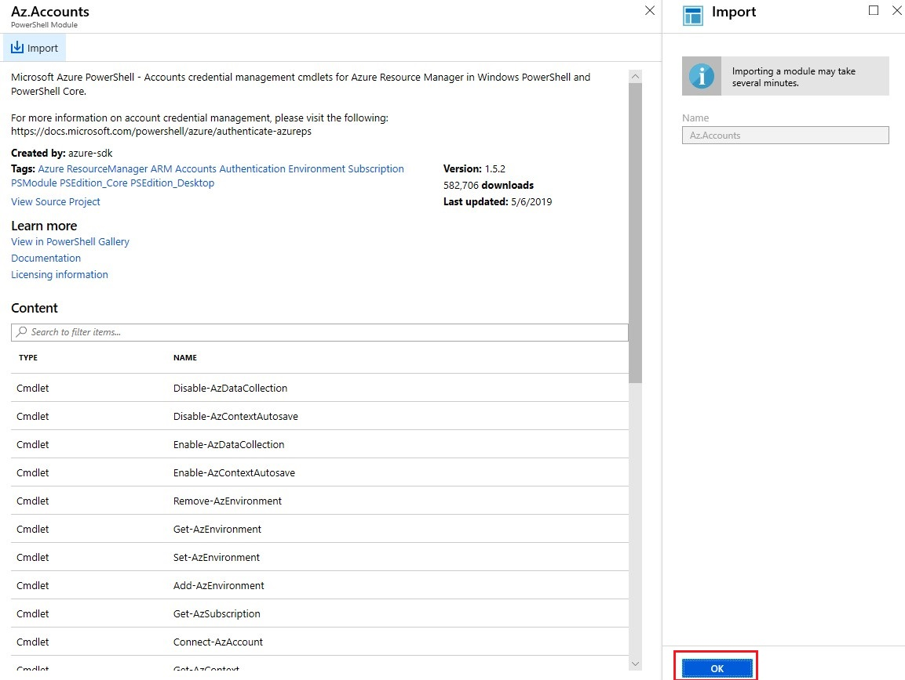

7. The Module blade will automatically open.  Wait for the Import process to complete.  Once complete, the module will look like this:

    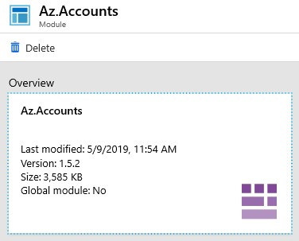

8. Repeat this process for the Az.Sql module.

# Create Azure Automation Credentials for the Registered App

Next, we need to create Azure Automation Credentials for the newly registered app, i.e. Service Principal.  For more information on Azure Automation Credentials, see [Credential Assets in Azure Automation](../automation/shared-resources/credentials.md)

> [!IMPORTANT]
> Azure Automation Credentials are backed by Azure Key Vault.  It is always recommended to securely store all credentials and access tokens.

1. Navigate to the Azure Automation Account in the Azure Portal.
2. Select the Credentials Tab from the left Navigation Pane.

    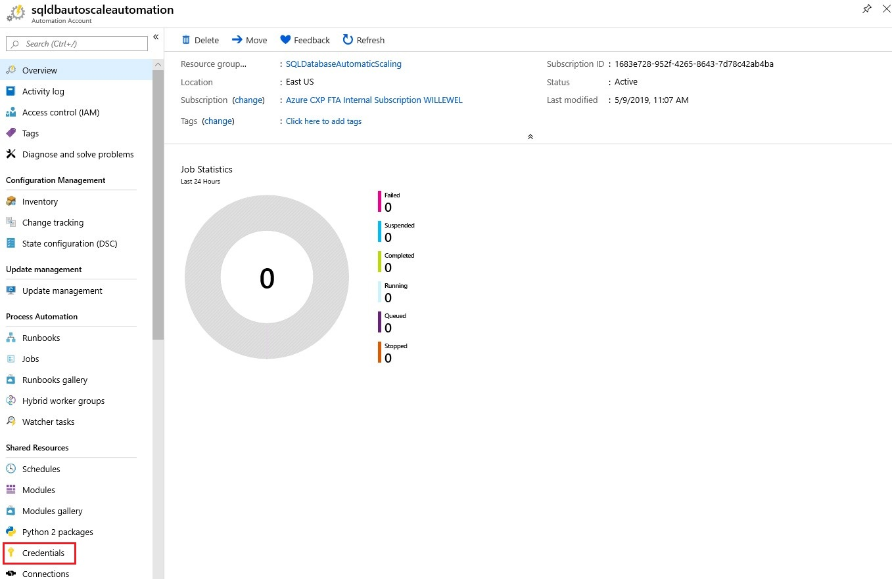

3. Select the Add a Credential Option from the top Navigation Menu.

    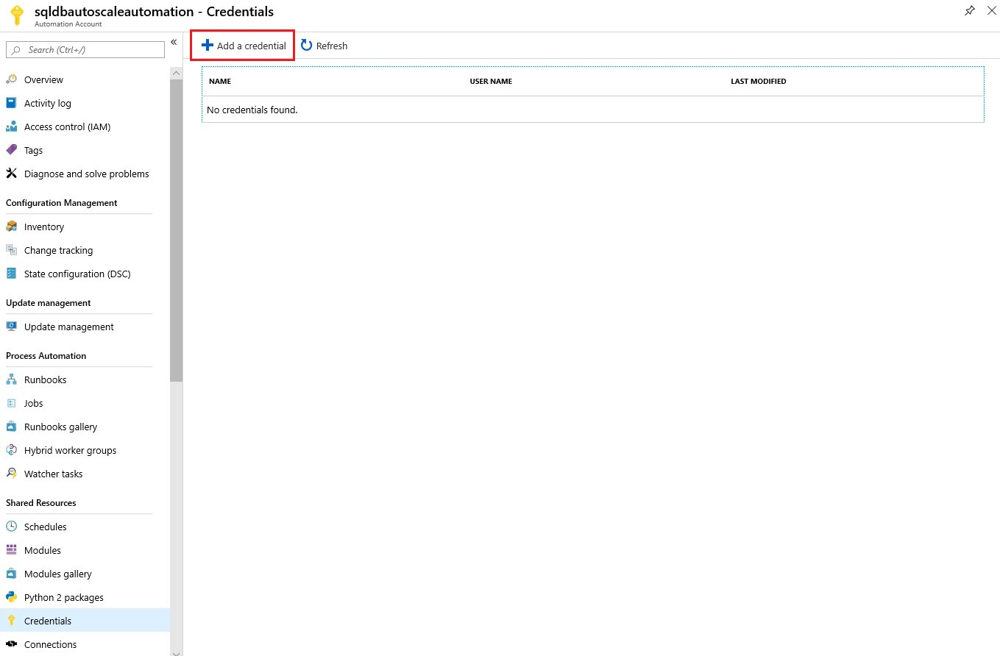

4. Use the Following Values for the New Credential and Select the Create Button:

* **Name**: The Name of the Registered App
* **User Name**: The Application (Client) ID of the Registered App
* **Password**: The Client Secret of the Registered App

    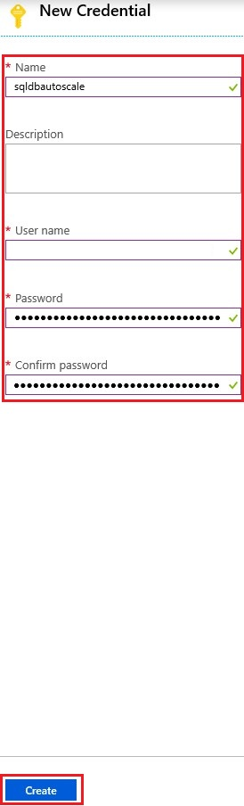

# Create an Azure Automation Powershell Runbook to programmatically scale the Azure SQL Database

Now, we need to create a Powershell Runbook called ScaleSQLDB.  For a primer on creating your first Azure Automation Runbook, see [Quickstart: Create an Azure Automation Runbook](../automation/automation-quickstart-create-account.md).

Copy the following code into the [Online Runbook Editor](automation/automation-edit-textual-runbook.md):

    # Runbook Parameters with default values
    
    param(
        [Parameter (Mandatory = $false)]
        [object] $WebhookData,
        
        [Parameter (Mandatory = $true)]
        [string] $ResourceGroupName,
    
        [Parameter (Mandatory = $true)]
        [string] $ServerName,
    
        [Parameter (Mandatory = $true)]
        [string] $DatabaseName,
    
        [Parameter (Mandatory = $true)]
        [string] $ServicePrincipalTenantId,
    
        [Parameter (Mandatory = $true)]
        [string] $CredentialName,
    
        [Parameter (Mandatory = $false)]
        [string] $MinimumServiceLevel = "",
    
        [Parameter (Mandatory = $false)]
        [string] $MaximumServiceLevel = "",
    
        [Parameter (Mandatory = $false)]
        [string] $ScaleDirection = "Up"
    )
    
    # Retrieves Credential from Azure Automation Account
    
    $Credential = Get-AutomationPSCredential `
        -Name $CredentialName
    
    # Connects to Azure Account using Service Principal Credential
    
    Connect-AzAccount `
        -Credential $Credential `
        -Tenant $ServicePrincipalTenantId `
        -ServicePrincipal
    
    # Retrieves Metadata for this Azure SQL Database
    
    $Database = Get-AzSqlDatabase `
        -ResourceGroupName $ResourceGroupName `
        -ServerName $ServerName `
        -DatabaseName $DatabaseName
    
    # Parses Service Tier and Service Level for this Azure SQL Database
    
    $ServiceTier = $Database.Edition
    $ServiceLevel = $Database.CurrentServiceObjectiveName
    
    # Retrieves List of Allowable Service Tiers for this Azure SQL Server
    
    $ServiceLevels = Get-AzSqlServerServiceObjective `
        -ResourceGroupName $ResourceGroupName `
        -ServerName $ServerName
    
    # Filters List of Allowable Service Levels to the Current Service Tier, Sorted by DTU
    
    $ServiceLevelsFiltered = (
        $ServiceLevels `
            | Where-Object{($_.Capacity -gt 0)} `
            | Where-Object{($_.SkuName -eq $ServiceTier)} `
            | Sort-Object{($_.Capacity)} `
        ).ServiceObjectiveName
    
    # Calculates the Total Number of Allowable Service Levels
    
    $ServiceLevelCount = $ServiceLevelsFiltered.Count
    
    # Calculates the Index for the Minimum Allowable Service Level
    
    $MinimumServiceLevelIndex = [array]::IndexOf($ServiceLevelsFiltered, $MinimumServiceLevel)
    $MinimumServiceLevelIndexFinal = [math]::max(0, $MinimumServiceLevelIndex)
    
    # Calculates the Index for the Maximum Allowable Service Level
    
    $MaximumServiceLevelIndex = [array]::IndexOf($ServiceLevelsFiltered, $MaximumServiceLevel)
    if($MaximumServiceLevelIndex -lt 0){
        $MaximumServiceLevelIndexFinal = $ServiceLevelCount - 1
    }else{
        $MaximumServiceLevelIndexFinal = [math]::min($MaximumServiceLevelIndex, $ServiceLevelCount - 1)
    }
    
    # Determines the Requested Service Level
    
    $ServiceLevelIndex = [array]::IndexOf($ServiceLevelsFiltered, $ServiceLevel)
    if(
        $ScaleDirection -eq "Up" `
        -or `
        $ScaleDirection -eq "U"
    ){
        $RequestedServiceLevelIndex = $ServiceLevelIndex + 1
    }elseif(
        $ScaleDirection -eq "Down" `
        -or `
        $ScaleDirection -eq "D"
    ){
        $RequestedServiceLevelIndex = $ServiceLevelIndex - 1
    }
    
    # Scales this Azure SQL Database if the Requested Service Level is between the Minimum and Maximum Allowable Service Levels and not equal to the Existing Service Level
    
    if(
        $RequestedServiceLevelIndex -le $MaximumServiceLevelIndexFinal `
        -and `
        $RequestedServiceLevelIndex -ge $MinimumServiceLevelIndexFinal `
        -and `
        $RequestedServiceLevelIndex -ne $ServiceLevelIndex
    ){
        $RequestedServiceLevel = $ServiceLevelsFiltered[$RequestedServiceLevelIndex]
    
        $database = Set-AzSqlDatabase `
            -ResourceGroupName $ResourceGroupName `
            -ServerName $ServerName `
            -DatabaseName $DatabaseName `
            -Edition $ServiceTier `
            -RequestedServiceObjectiveName $RequestedServiceLevel
    }

Basically, this code snippet determines the current service level of the Azure SQL Database and scales it up or down based on the parameters that are passed into it.  This script has a few important caveats:

* The script will never scale the Azure SQL Database more than one service level per execution, e.g. S1 to S3.
* The script will not scale the Azure SQL Database to a different service tier, e.g. Standard to Premium.

Here's a description of each Parameter:

* **WebhookData**: This is a standard parameter that enables the use of Webhooks.  The snippet can be easily modified to parse the other parameter values from this if necessary.
* **ResourceGroupName**: The name of the Azure Resource Group that contains the Azure SQL Database to be scaled.
* **ServerName**: The name of the Azure SQL Server that contains the Azure SQL Database to be scaled.
* **DatabaseName**: The name of the Azure SQL Database to be scaled.
* **ServicePrincipalTenantId**: The Tenant ID of the Registered App, i.e. Service Principal, that has privileges to scale the Azure SQL Database.
* **CredentialName**: The name of the Azure Automation Credential that contains the Application (Client) ID and Application Secret of the Registered App, i.e. Service Principal, that has privileges to scale the Azure SQL Database.
* **MinimumServiceLevel**: The smallest possible service level that the script is allowed to scale the Azure SQL Database to.  If this is left blank, the snippet will use the smallest service level within the current service tier.
* **MaximumServiceLevel**: The largest possible service level that the script is allowed to scale the Azure SQL Database to.  If this is left blank, the snippet will use the largest service level within the current service tier.
* **ScaleDirection**: Whether the script will scale the Azure SQL Database Up or Down.  Allowable Options are Up, U, Down and D.  Any other options will result in no scaling taking place.

After Publishing the Runbook, you can Run the Runbook from the Runbook blade.  This creates an [Azure Automation Job](../automation/automation-runbook-execution.md).

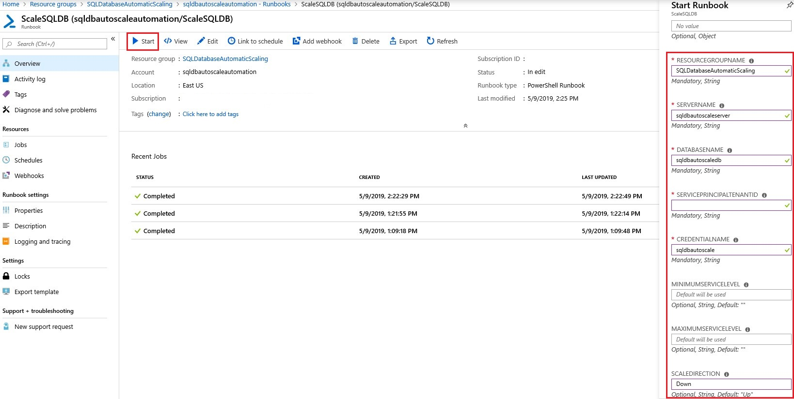

After the job completes, you can see that the Azure SQL Database has been scaled to the S0 Service Level.

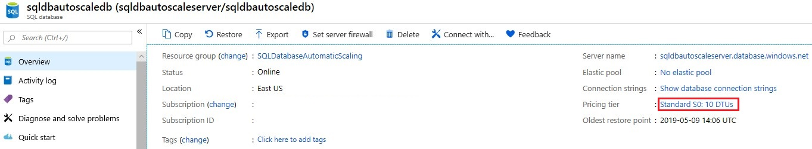

# Create Automatic Scaling Runbook Using Azure Automation

Next, we need to trigger the Azure Automation Runbook based on Usage Metrics for the Azure SQL Database.

1. Before we being, manually scale the Azure SQL Database back to the S1 service level using the Azure portal.
2. Import the Az.Monitor Module from the Gallery using the same technique described earlier.
3. Create another Azure Automation Powershell Runbook called MonitorSQLDB using the same Azure Automation Account.
4. Use the following snippet for the Runbook:

###

    # Runbook Parameters with default values
    
    param(
        [Parameter (Mandatory = $false)]
        [object] $WebhookData,
        
        [Parameter (Mandatory = $true)]
        [string] $ResourceGroupName,
    
        [Parameter (Mandatory = $true)]
        [string] $ServerName,
    
        [Parameter (Mandatory = $true)]
        [string] $DatabaseName,
    
        [Parameter (Mandatory = $true)]
        [string] $ServicePrincipalTenantId,
    
        [Parameter (Mandatory = $true)]
        [string] $CredentialName,
    
        [Parameter (Mandatory = $false)]
        [int] $ScaleUpThreshold = 75,
    
        [Parameter (Mandatory = $false)]
        [int] $ScaleDownThreshold = 25,
        
        [Parameter (Mandatory = $false)]
        [string] $MetricName = "dtu_consumption_percent",
    
        [Parameter (Mandatory = $false)]
        [string] $AggregationWindow = "01:00:00",
    
        [Parameter (Mandatory = $false)]
        [string] $AggregationGrain = "00:05:00",
    
        [Parameter (Mandatory = $false)]
        [string] $MinimumServiceLevel = "",
    
        [Parameter (Mandatory = $false)]
        [string] $MaximumServiceLevel = ""
    )
    
    # Retrieves Credential from Azure Automation Account
    
    $Credential = Get-AutomationPSCredential `
        -Name $CredentialName
    
    # Connects to Azure Account using Service Principal Credential
    
    Connect-AzAccount `
        -Credential $Credential `
        -Tenant $ServicePrincipalTenantId `
        -ServicePrincipal
    
    # Retrieves Metadata for this Azure SQL Database
    
    $Database = Get-AzSqlDatabase `
        -ResourceGroupName $ResourceGroupName `
        -ServerName $ServerName `
        -DatabaseName $DatabaseName
    
    # Parses Resource ID for this Azure SQL Database
    
    $ResourceId = $Database.ResourceId
    
    # Calculates the Start Time for the Metric
    
    $AggregationTimeGrain = [TimeSpan]::Parse($AggregationGrain)
    $AggregationTimeSpan = [TimeSpan]::Parse($AggregationWindow)
    $StartTime = (Get-Date) - $AggregationTimeSpan
    
    # Retrieves the Metric Values
    
    $Metrics = Get-AzMetric `
        -ResourceId $ResourceId `
        -StartTime $StartTime `
        -TimeGrain $AggregationTimeGrain `
        -MetricName $MetricName
    
    # Aggregates the Metric Values
    
    $MetricsAggregate = ($Metrics.Data.Average | Measure-Object -Average -Minimum)
    
    # Checks Aggregated Metric Values against Scaling Thresholds
    
    if(
        $MetricsAggregate.Minimum -gt 0 `
        -and
        $MetricsAggregate.Average -lt $ScaleDownThreshold
    ){
        .\ScaleSQLDB.ps1 `
    		-ResourceGroupName $ResourceGroupName `
            -ServerName $ServerName `
            -DatabaseName $DatabaseName `
            -ServicePrincipalTenantId $ServicePrincipalTenantId `
            -CredentialName $CredentialName `
    		-MaximumServiceLevel $MinimumServiceLevel `
    		-MinimumServiceLevel $MaximumServiceLevel `
    		-ScaleDirection "Down"
    }elseif(
        $MetricsAggregate.Average -gt $ScaleUpThreshold
    ){
        .\ScaleSQLDB.ps1 `
    		-ResourceGroupName $ResourceGroupName `
            -ServerName $ServerName `
            -DatabaseName $DatabaseName `
            -ServicePrincipalTenantId $ServicePrincipalTenantId `
            -CredentialName $CredentialName `
    		-MaximumServiceLevel $MinimumServiceLevel `
    		-MinimumServiceLevel $MaximumServiceLevel `
    		-ScaleDirection "Up"
    }

Basically, this code snippet queries the Metrics for the Azure SQL Database and determines whether to scale the Azure SQL Database.  This snippet has one major caveat.

For databases that see long periods of no use, resulting in a DTU usage of zero, a sudden spike in usage could result in a very low average historic DTU usage, despite a very high current DTU usage.  For this reason, this snippet will not scale down an Azure SQL Database if there is any time grain showing a DTU usage of zero.  This behavior can be altered within the script itself.

Here's a description of each Parameter:

* **WebhookData**: This is a standard parameter that enables the use of Webhooks.  The snippet can be easily modified to parse the other parameter values from this if necessary.
* **ResourceGroupName**: The name of the Azure Resource Group that contains the Azure SQL Database to be scaled.
* **ServerName**: The name of the Azure SQL Server that contains the Azure SQL Database to be scaled.
* **DatabaseName**: The name of the Azure SQL Database to be scaled.
* **ServicePrincipalTenantId**: The Tenant ID of the Registered App, i.e. Service Principal, that has privileges to scale the Azure SQL Database.
* **CredentialName**: The name of the Azure Automation Credential that contains the Application (Client) ID and Application Secret of the Registered App, i.e. Service Principal, that has privileges to scale the Azure SQL Database.
* **ScaleUpThreshold**: The threshold for deciding whether to scale up the Azure SQL Database.  An average value of more than this threshold will result in a call to scale up the Azure SQL Database.  This threshold is unit-less and will differ based on the Metric chosen.
* **ScaleDownThreshold**: The threshold for deciding whether to scale down the Azure SQL Database.  An average value of less than this threshold will result in a call to scale down the Azure SQL Database.  This threshold is unit-less and will differ based on the Metric chosen.
* **MetricName**: The name of the metric to be queried for the Azure SQL Database.  Available Metrics can be queried using [Az-GetMetricDefinitions](https://docs.microsoft.com/en-us/powershell/module/az.monitor/get-azmetricdefinition?view=azps-2.0.0).
* **AggregationWindow**: The length of the historic window for the metric to be queried.  This parameter uses the "HH:MM:SS" Syntax.  For instance, "01:00:00" will query for the metric values for each in the previous hour.
* **AggregationGrain**: The length of the interval window for the metric to be aggregated.  This parameter uses the "HH:MM:SS" Syntax.  For instance, "00:05:00" will aggregate the minute-by-minute values into five minute windows. These windows will then be averaged to create a single metric.
* **MinimumServiceLevel**: The smallest possible service level that the script is allowed to scale the Azure SQL Database to.  If this is left blank, the snippet will use the smallest service level within the current service tier.
* **MaximumServiceLevel**: The largest possible service level that the script is allowed to scale the Azure SQL Database to.  If this is left blank, the snippet will use the largest service level within the current service tier.

# Simulate Load on the Database

Running the MonitorSQLDB Runbook at this time would have no effect because there is no load on the Azure SQL Database.  To simulate load, connect to the Azure SQL Database using the tool of your choice and run the following snippet:

> [!IMPORTANT]
> You may need to add your IP Address to the Azure SQL Server Firewall to gain access.  For more information, see [Azure SQL Database and SQL Data Warehouse IP Firewall Rules](sql-database-firewall-configure.md).

    DECLARE @i INT = 0;
    
    WHILE @i < 1000
    BEGIN
    	SELECT
    		[SalesOrderDetailID]
    		,[OrderQty]
    		,P.[ProductID]
    		,[UnitPrice]
    		,[UnitPriceDiscount]
    		,[LineTotal]
    		,SOH.[SalesOrderID]
    		,[RevisionNumber]
    		,[OrderDate]
    		,[DueDate]
    		,[ShipDate]
    		,[Status]
    		,[OnlineOrderFlag]
    		,[SalesOrderNumber]
    		,[PurchaseOrderNumber]
    		,[AccountNumber]
    		,C.[CustomerID]
    		,[ShipToAddressID]
    		,[BillToAddressID]
    		,[ShipMethod]
    		,[CreditCardApprovalCode]
    		,[SubTotal]
    		,[TaxAmt]
    		,[Freight]
    		,[TotalDue]
    		,[Comment]
    		,P.[Name]
    		,[ProductNumber]
    		,[Color]
    		,[StandardCost]
    		,[ListPrice]
    		,[Size]
    		,[Weight]
    		,P.[ProductCategoryID]
    		,P.[ProductModelID]
    		,[SellStartDate]
    		,[SellEndDate]
    		,[DiscontinuedDate]
    		,[ThumbNailPhoto]
    		,[ThumbnailPhotoFileName]
    		,[NameStyle]
    		,[Title]
    		,[FirstName]
    		,[MiddleName]
    		,[LastName]
    		,[Suffix]
    		,[CompanyName]
    		,[SalesPerson]
    		,[EmailAddress]
    		,[Phone]
    		,[PasswordHash]
    		,[PasswordSalt]
    		,[AddressID]
    		,[AddressLine1]
    		,[AddressLine2]
    		,[City]
    		,[StateProvince]
    		,[CountryRegion]
    		,[PostalCode]
    		,[ParentProductCategoryID]
    		,[CatalogDescription]
    		,[Culture]
    		,[Description]
    	INTO Temp
    	FROM SalesLT.SalesOrderDetail AS SOD
    	INNER JOIN SalesLT.SalesOrderHeader AS SOH
    		ON SOD.SalesOrderID = SOH.SalesOrderID
    	INNER JOIN SalesLT.Product AS P
    		ON SOD.ProductID = P.ProductID
    	INNER JOIN SalesLT.Customer AS C
    		ON SOH.CustomerID = C.CustomerID
    	INNER JOIN SalesLT.Address AS STA
    		ON SOH.ShipToAddressID = STA.AddressID
    	INNER JOIN SalesLT.ProductCategory AS PC
    		ON P.ProductCategoryID = PC.ProductCategoryID
    	INNER JOIN SalesLT.ProductModel AS PM
    		ON P.ProductModelID = PM.ProductModelID
    	INNER JOIN SalesLT.ProductModelProductDescription AS PMPD
    		ON P.ProductModelID = PMPD.ProductModelID
    	INNER JOIN SalesLT.ProductDescription AS PD
    		ON PMPD.ProductDescriptionID = PD.ProductDescriptionID
    	;
    
    	DROP TABLE Temp;
    
    	SET @i = @i + 1;
    END

This snippet will create a 100% DTU load on the S1 Azure SQL Database.  After letting the snippet run for at least fifteen minutes, you should see substantial load on the Azure SQL Database.

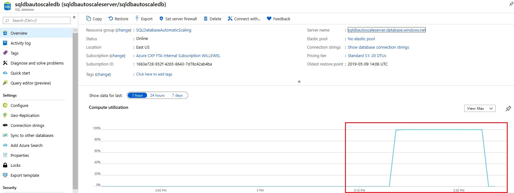

1. Run the MonitorSQLDB Runbook using the following parameters:

* **WebhookData**: Empty
* **ResourceGroupName**: The name of the Azure Resource Group that contains the Azure SQL Database to be scaled.
* **ServerName**: The name of the Azure SQL Server that contains the Azure SQL Database to be scaled.
* **DatabaseName**: The name of the Azure SQL Database to be scaled.
* **ServicePrincipalTenantId**: The Tenant ID of the Registered App, i.e. Service Principal, that has privileges to scale the Azure SQL Database.
* **CredentialName**: The name of the Azure Automation Credential that contains the Application (Client) ID and Application Secret of the Registered App, i.e. Service Principal, that has privileges to scale the Azure SQL Database.
* **ScaleUpThreshold**: Empty
* **ScaleDownThreshold**: Empty
* **MetricName**: Empty
* **AggregationWindow**: 00:10:00
* **AggregationGrain**: 00:01:00
* **MinimumServiceLevel**: Empty
* **MaximumServiceLevel**: Empty

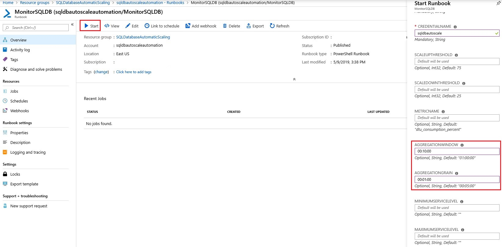

The Job will recognize that the database is under heavy load and scale it up to the S2 service level.  If the SQL Database is stuck with the "Online - Updating Database Pricing Tier" banner, you may have to manually stop the SQL query.

# Automate the Azure Automation Runbook using Azure Automation Schedules

The MonitorSQLDB Runbook can be scheduled using Azure Automation Schedules.  For a primer on scheduling your first Azure Automation Runbook, see [Scheduling a Runbook in Azure Automation](../automation/shared-resources/schedules.md).

> [!IMPORTANT]
> The shortest scheduling window in Azure Automation is one hour.

# Automate the Azure Automation Runbook using Logic Apps

The MonitorSQLDB Runbook can also be scheduled using Azure Logic Apps.  Azure Logic Apps give us much finer control over when the Azure Automation Runbooks are triggered.  For a primer on creating your first Logic App, see [Quickstart: Create your First Automated Workflow with Azure Logic Apps - Azure portal](../logic-apps/quickstart-create-first-logic-app-workflow.md).

1. Using the Azure Portal, create a Logic App named sqldbautoscalela.

    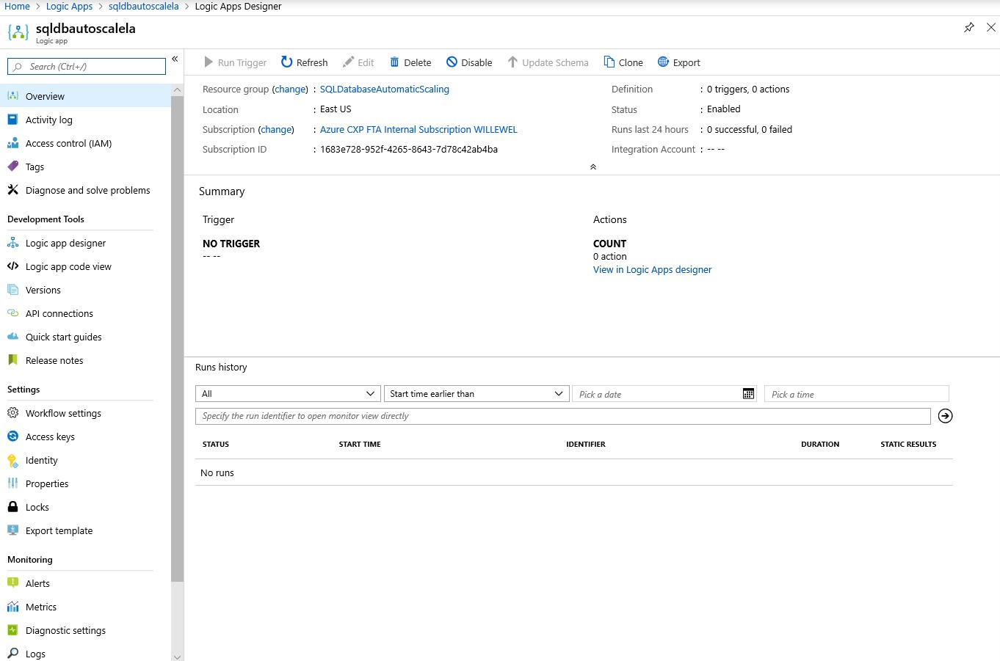

2. Using the Logic Apps Designer, add a [Schedule - Recurrence](../connectors/connectors-native-recurrence.md) trigger with a ten minute interval.

    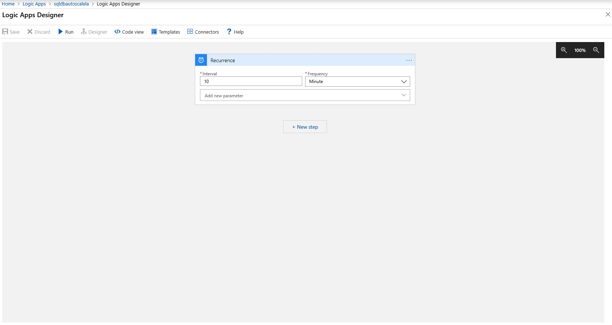

3. Using the Logic Apps Designer, add an Azure Automation - Create Job action with the following parameters:

    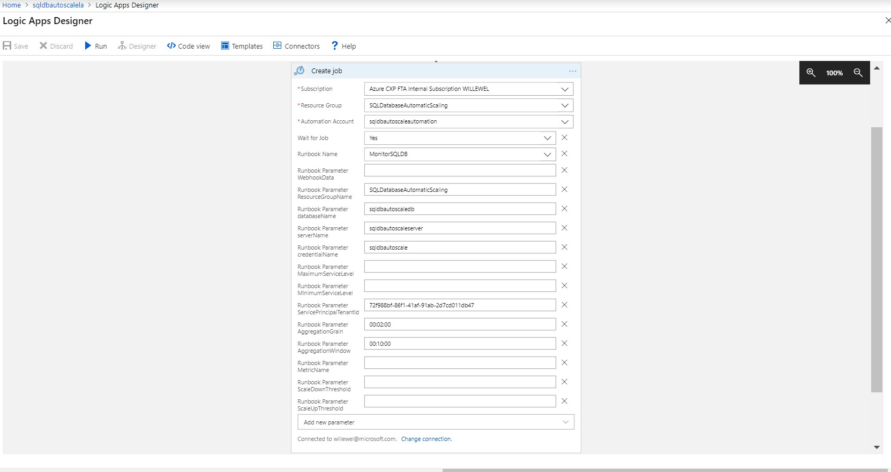

* **Subscription**: The name of the Azure Subscription that contains the Azure Automation Runbook to be executed.
* **Resource Group**: The name of the Azure Resource Group that contains the Azure Automation Runbook to be executed.
* **Automation Account**: The name of the Azure Automation Account that contains the Azure Automation Runbook to be executed.
* **Wait for Job**: Yes
* **Runbook Name**: MonitorSQLDB
* **Runbook Parameter WebhookData**: Empty
* **Runbook Parameter ResourceGroupName**: The name of the Azure Resource Group that contains the Azure SQL Database to be scaled.
* **Runbook Parameter DatabaseName**: The name of the Azure SQL Database to be scaled.
* **Runbook Parameter ServerName**: The name of the Azure SQL Server that contains the Azure SQL Database to be scaled.
* **Runbook Parameter CredentialName**: The name of the Azure Automation Credential that contains the Application (Client) ID and Application Secret of the Registered App, i.e. Service Principal, that has privileges to scale the Azure SQL Database.
* **Runbook Parameter MinimumServiceLevel**: Empty
* **Runbook Parameter MaximumServiceLevel**: Empty
* **Runbook Parameter ServicePrincipalTenantId**: The Tenant ID of the Registered App, i.e. Service Principal, that has privileges to scale the Azure SQL Database.
* **Runbook Parameter AggregationGrain**: 00:02:00
* **Runbook Parameter AggregationWindow**: 00:10:00
* **Runbook Parameter MetricName**: Empty
* **Runbook Parameter ScaleUpThreshold**: Empty
* **Runbook Parameter ScaleDownThreshold**: Empty

4. Save the Azure Logic App.

The Azure Logic App should now run every 10 minutes, automatically scaling the Azure SQL Database according to the parameters laid out.  You can test it by running the Load Simulation script from earlier.

# Automate the Azure Automation Runbook using Azure Classic Metric Alerts

The Azure Automation Runbook can also be triggered by Azure Classic Metric Alerts.  The previous methods mentioned were triggered on a schedule.  Azure Classic Metric Alerts will allow us to trigger the scaling based on events.  In other words, instead of checking the metrics every ten minutes, we can have the Azure Automation Runbook trigger only when the DTU percentage passes one of the thresholds.  For a primer on creating your first Azure Classic Metric Alert, see [Create, View, and Manage Classic Metric Alerts using Azure Monitor](../azure-monitor/platform/alerts-classic-portal.md).

> [!IMPORTANT]
> Azure Classic Metric Alerts do not support directly creating Azure Automation Jobs.  They must be created indirectly via Azure Logic Apps, which can be executed by Azure Class Metric Alerts.
>
> Unified Azure Metric Alerts will be able to directly create Azure Automation Jobs.  Once this functionality is released for Azure SQL Database, see [Use the Voluntary Migration Tool to Migrate your Classic Alert Rules](../azure-monitor/platform/alerts-using-migration-tool.md) for migration information.

1. Create an Azure Logic App name sqlautoscalealertla.
2. Add an [HTTP Request](../connectors/connectors-native-http.md) trigger to the Azure Logic App.
    * This trigger will not actually be used, but is available for external calls as well.
3. Using the Logic Apps Designer, add an Azure Automation - Create Job action with the following parameters:

    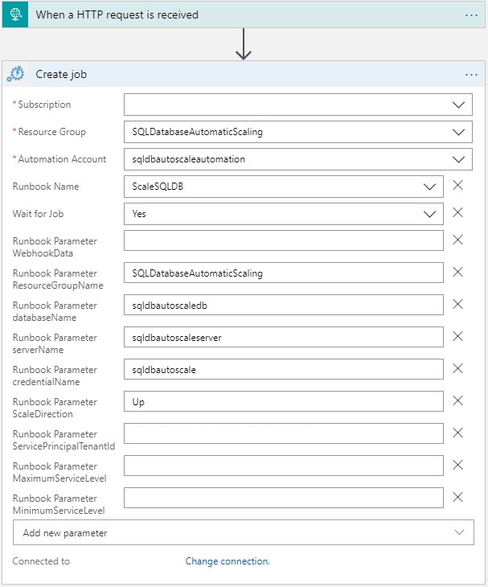

* **Subscription**: The name of the Azure Subscription that contains the Azure Automation Runbook to be executed.
* **Resource Group**: The name of the Azure Resource Group that contains the Azure Automation Runbook to be executed.
* **Automation Account**: The name of the Azure Automation Account that contains the Azure Automation Runbook to be executed.
* **Wait for Job**: Yes
* **Runbook Name**: ScaleSQLDB
* **Runbook Parameter WebhookData**: Empty
* **Runbook Parameter ResourceGroupName**: The name of the Azure Resource Group that contains the Azure SQL Database to be scaled.
* **Runbook Parameter DatabaseName**: The name of the Azure SQL Database to be scaled.
* **Runbook Parameter ServerName**: The name of the Azure SQL Server that contains the Azure SQL Database to be scaled.
* **Runbook Parameter CredentialName**: The name of the Azure Automation Credential that contains the Application (Client) ID and Application Secret of the Registered App, i.e. Service Principal, that has privileges to scale the Azure SQL Database.
* **Runbook Parameter ServicePrincipalTenantId**: The Tenant ID of the Registered App, i.e. Service Principal, that has privileges to scale the Azure SQL Database.
* **Runbook Parameter MinimumServiceLevel**: Empty
* **Runbook Parameter MaximumServiceLevel**: Empty

4. Save the Azure Logic App.
5. Create an Azure Classic Alert for the Azure SQL Database using the following parameters:

    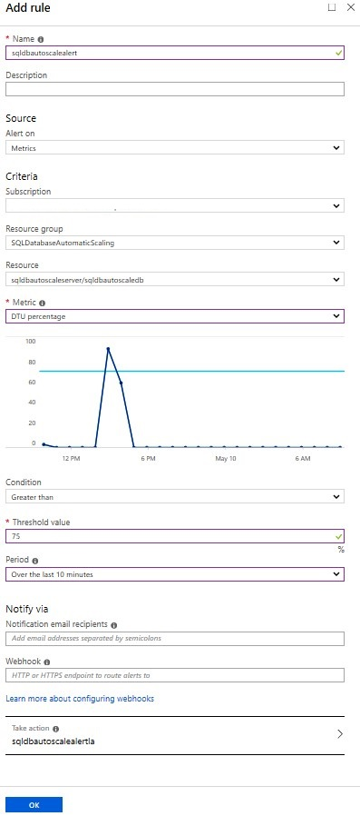

* **Name**: sqldbautoscalealert
* **Alert On**: Metrics
* **Subscription**: The name of the Azure Subscription that contains the Azure SQL Database to be monitored.
* **Resource Group**: The name of the Azure Resource Group that contains the Azure SQL Database to be monitored.
* **Resource**: The name of the Azure SQL Database to be monitored, in <Azure SQL Server>/<Azure SQL Database> format.
* **Metric**: DTU Percentage
* **Condition**: Greater Than
* **Threshold Value**: 75
* **Period**: Over the Last 10 Minutes
* **Take Action**: sqldbautoscalealertla

6. Click Ok.

# Next Steps

Congratulations!  You've now set up three ways to automatically scale your Azure SQL Database.  There a number of options for enhancing this solution to more closely match your needs.

* Check out [Azure SQL Database Serverless](sql-database-serverless.md) for a completely native automatic scaling experience.
* Alter the [Azure Automation Runbooks](../automation/automation-intro.md) to match your business logic.
* Alter the Azure Automation Runbooks to leverage [Webhooks](../automation/automation-webhooks.md) for more complex use cases.
* Modify the solution to support [Azure SQL Data Warehouse](../sql-data-warehouse/sql-data-warehouse-overview-what-is.md), [Azure SQL Database Managed Instance](sql-database-managed-instance-index.yml) and other technologies.